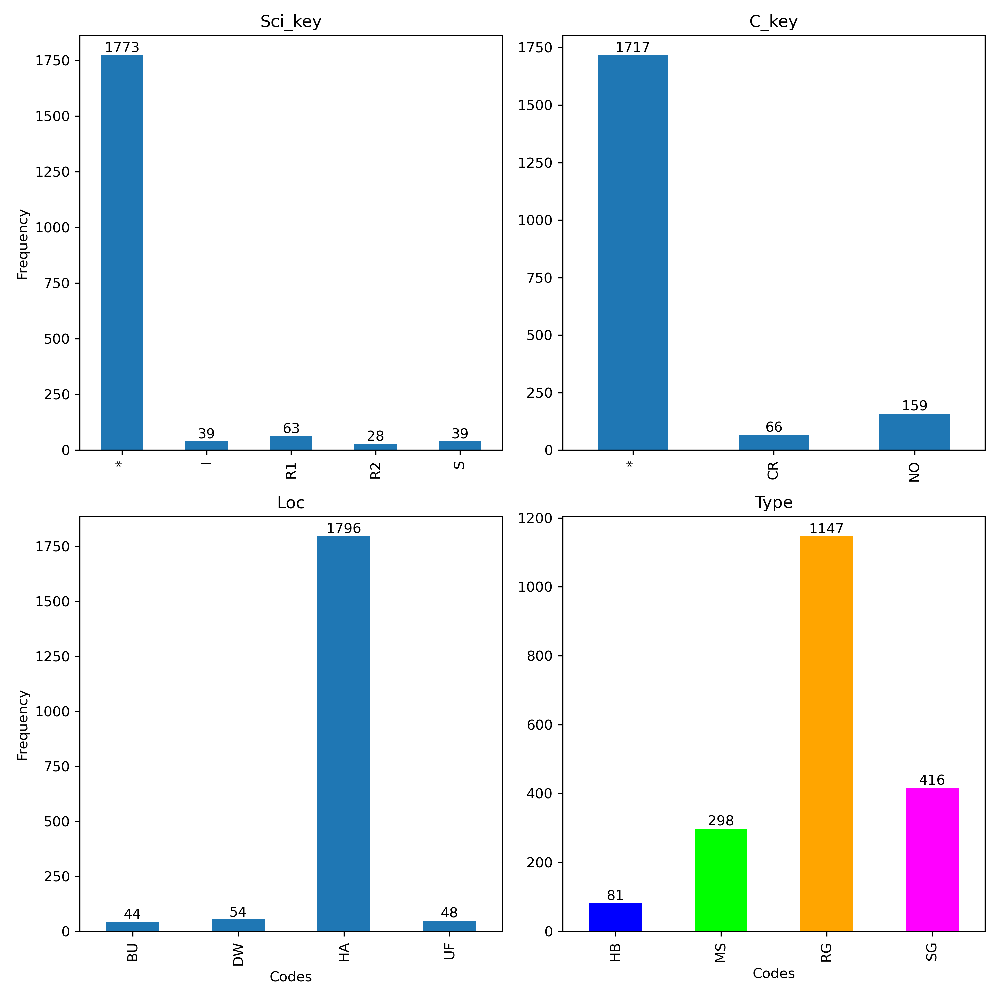
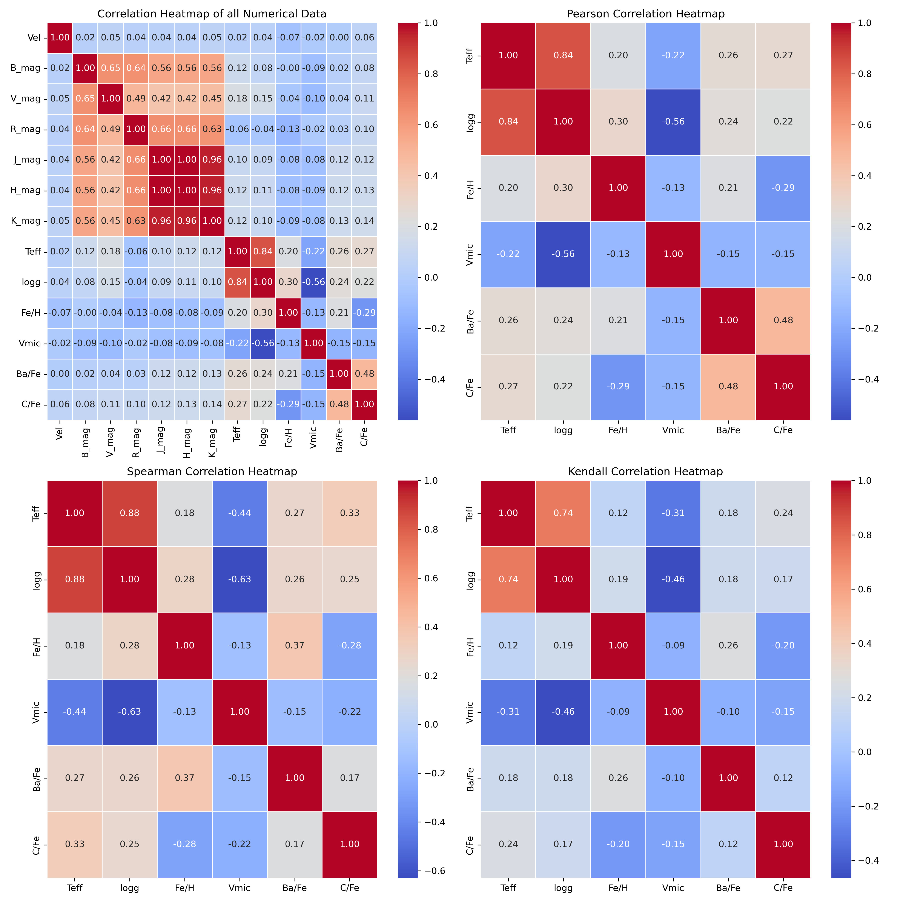
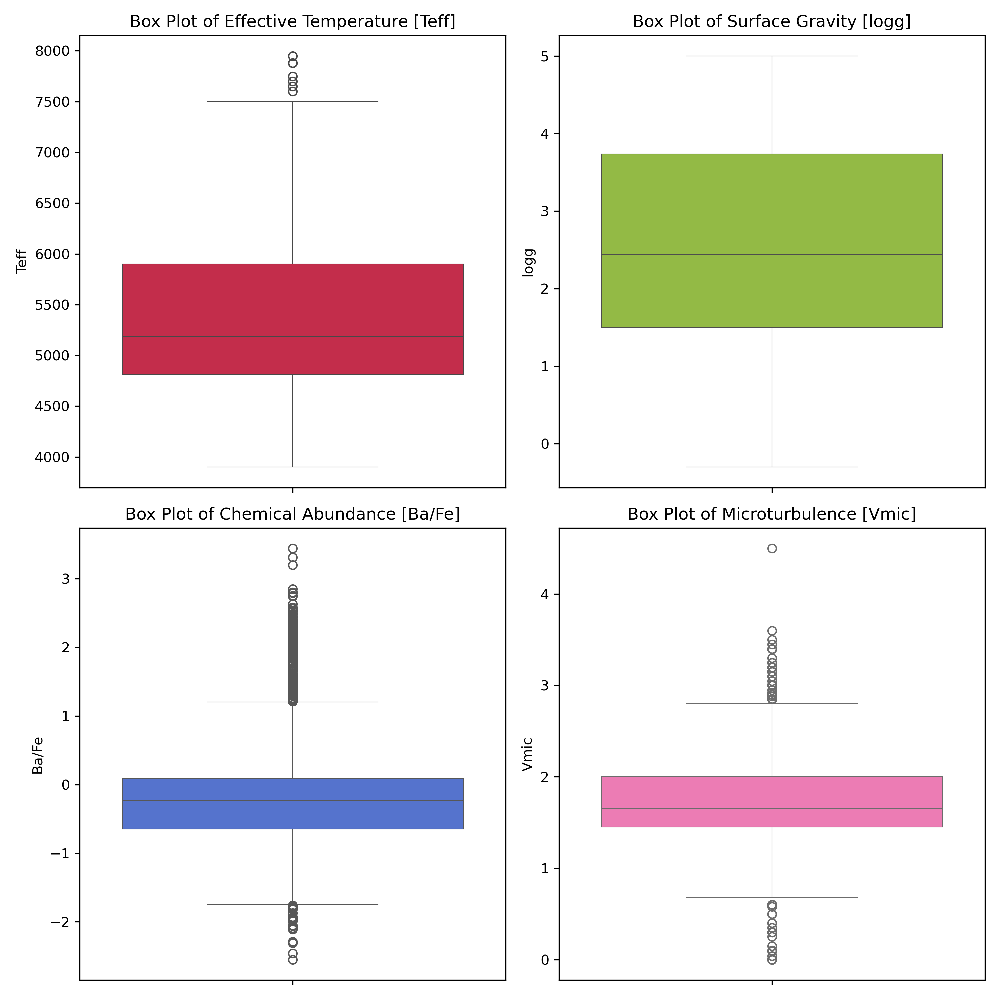
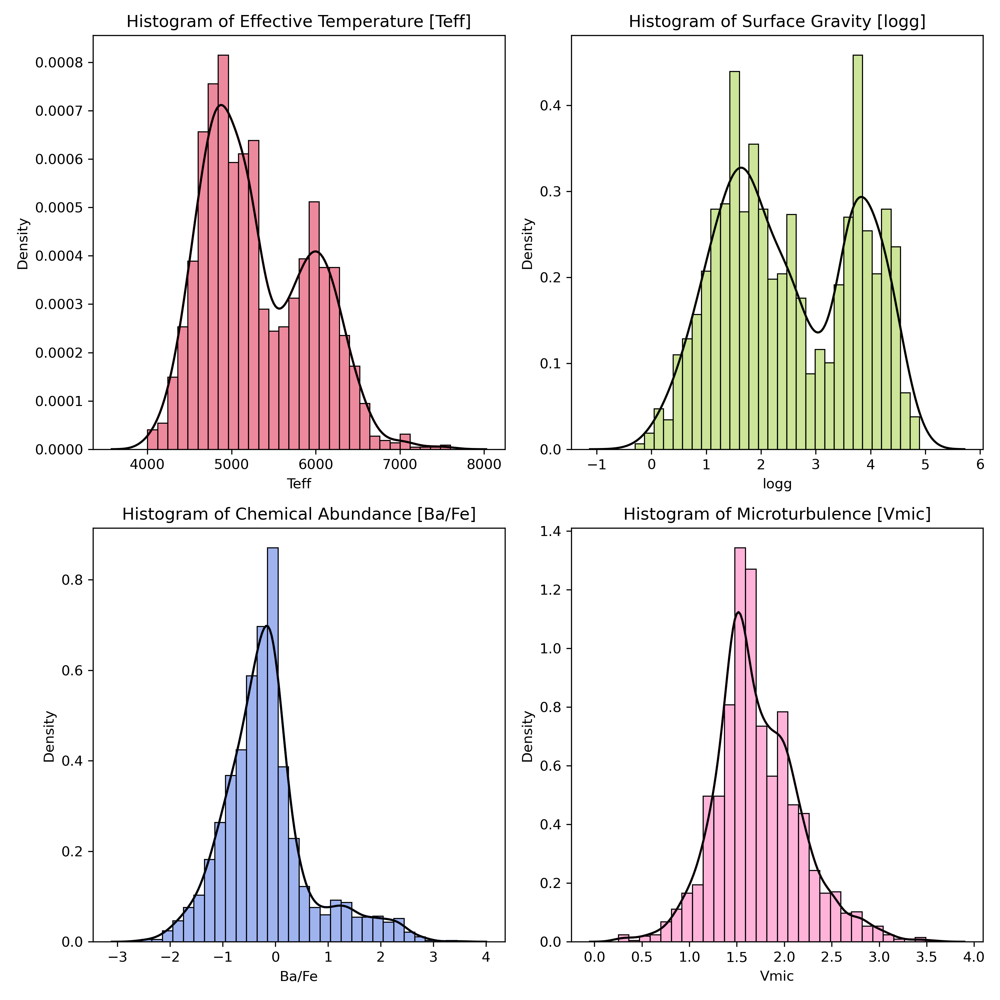
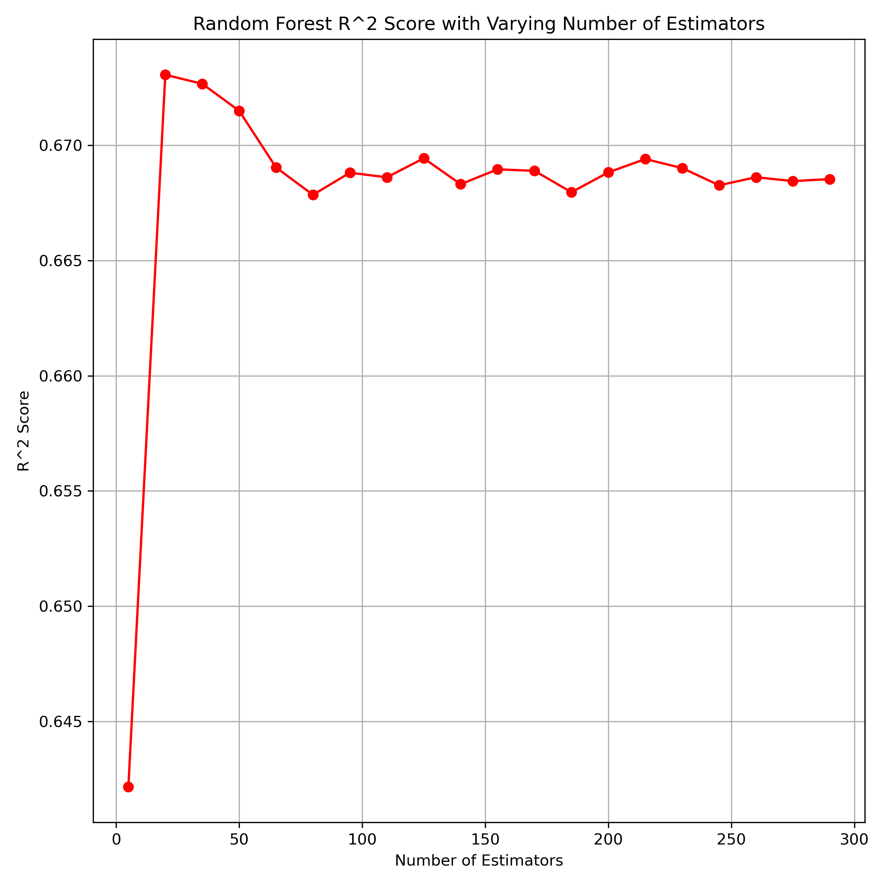
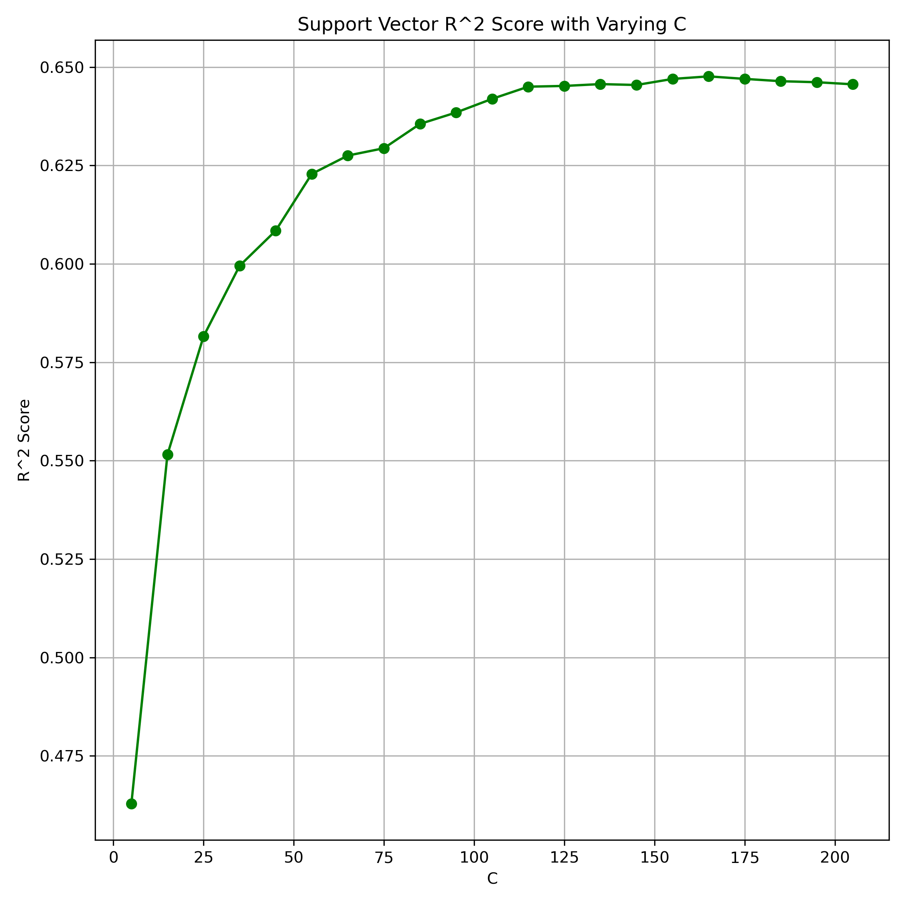
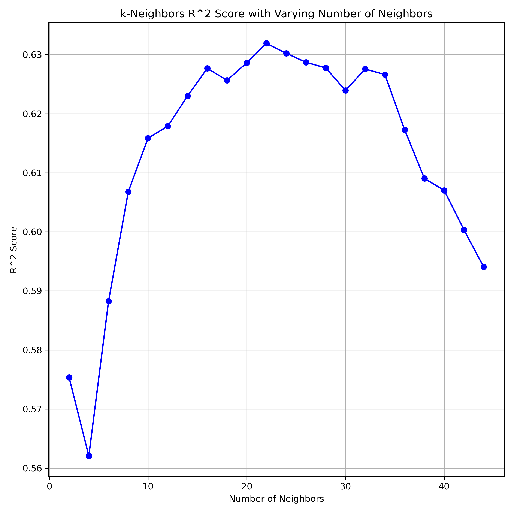
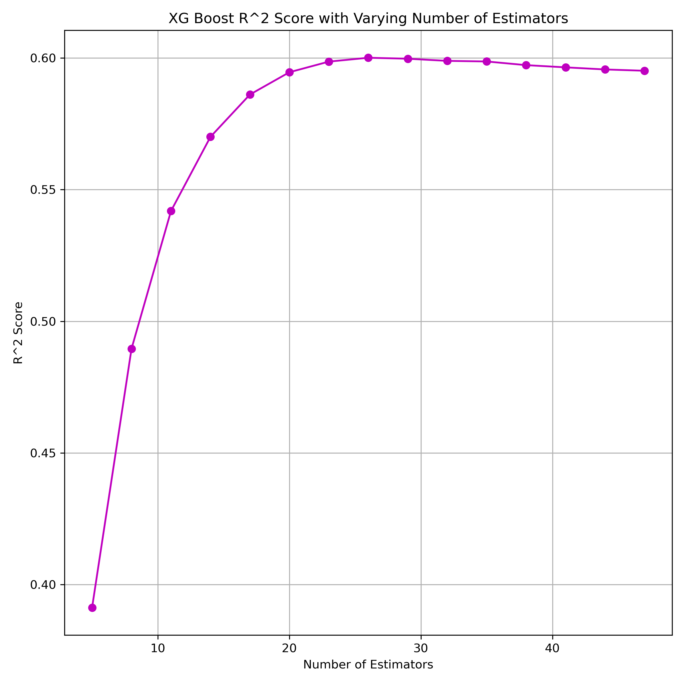
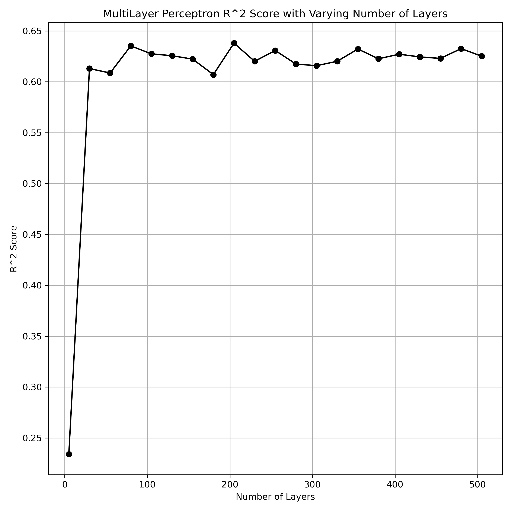
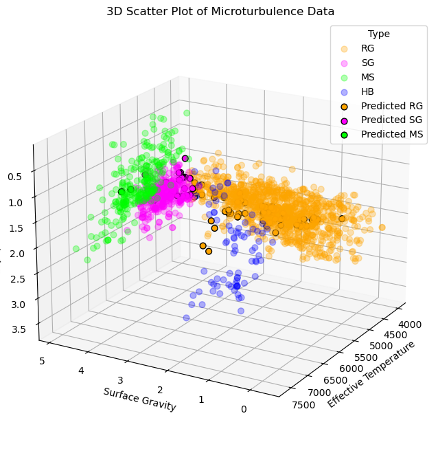

# Predictive Techniques for Astrophysics

Primarily applied pandas, and scikit-learn tools on [JINAbase](https://jinabase.pythonanywhere.com/) to do:
* regression/imputation - predict missing microturbulence values
* classification - classify stars based on stellar types

Report of this project can be found [here](https://github.com/dnshkmr7/jinabase-predictions/blob/main/EP4130_Project.pdf).

## Exploratory Data Analysis

 &nbsp;&nbsp;&nbsp;&nbsp;
 

 &nbsp;&nbsp;&nbsp;&nbsp;

## Performance

### Regression

 &nbsp;&nbsp;&nbsp;&nbsp;&nbsp;&nbsp;&nbsp;&nbsp;
 

 &nbsp;&nbsp;&nbsp;&nbsp;

### Classification

<table>
<tr>
<td>
  
**Random Forest Classifier**
| Class  | Precision | Recall | F1-Score | Support |
|--------|-----------|--------|----------|---------|
| HB     | 1.00      | 1.00   | 1.00     | 23      |
| MS     | 1.00      | 1.00   | 1.00     | 55      |
| RG     | 1.00      | 0.99   | 1.00     | 227     |
| SG     | 0.97      | 1.00   | 0.98     | 63      |
| **Accuracy**     |           |        | **0.99** | **368** |
| **Macro Avg**    | 0.99      | 1.00   | 0.99     | 368     |
| **Weight Avg** | 0.99      | 0.99   | 0.99     | 368     |

</td>
<td>

**Support Vector Classifier**
| Class  | Precision | Recall | F1-Score | Support |
|--------|-----------|--------|----------|---------|
| HB     | 0.95      | 0.91   | 0.93     | 23      |
| MS     | 1.00      | 0.96   | 0.98     | 55      |
| RG     | 0.99      | 0.99   | 0.99     | 227     |
| SG     | 0.94      | 1.00   | 0.97     | 63      |
| **Accuracy**     |           |        | **0.98** | **368** |
| **Macro Avg**    | 0.97      | 0.97   | 0.97     | 368     |
| **Weight Avg** | 0.98      | 0.98   | 0.98     | 368     |

</td>
</tr> 
</table>

<table>
<tr>
<td>

**KNN Classifier**
| Class  | Precision | Recall | F1-Score | Support |
|--------|-----------|--------|----------|---------|
| HB     | 1.00      | 0.83   | 0.90     | 23      |
| MS     | 1.00      | 0.87   | 0.93     | 55      |
| RG     | 0.99      | 0.99   | 0.99     | 227     |
| SG     | 0.86      | 1.00   | 0.93     | 63      |
| **Accuracy**     |           |        | **0.96** | **368** |
| **Macro Avg**    | 0.96      | 0.92   | 0.94     | 368     |
| **Weight Avg** | 0.97      | 0.96   | 0.96     | 368     |

</td>
<td>

**XGBoost Classifier**
| Class  | Precision | Recall | F1-Score | Support |
|--------|-----------|--------|----------|---------|
| HB     | 1.00      | 1.00   | 1.00     | 23      |
| MS     | 1.00      | 0.96   | 0.98     | 55      |
| RG     | 1.00      | 0.99   | 1.00     | 227     |
| SG     | 0.94      | 1.00   | 0.97     | 63      |
| **Accuracy**     |           |        | **0.99** | **368** |
| **Macro Avg**    | 0.99      | 0.99   | 0.99     | 368     |
| **Weight Avg** | 0.99      | 0.99   | 0.99     | 368     |

</td>
</tr> 
</table>

<table>
<tr>
<td>

**MLP Classifier**
| Class  | Precision | Recall | F1-Score | Support |
|--------|-----------|--------|----------|---------|
| HB     | 0.96      | 0.96   | 0.96     | 23      |
| MS     | 1.00      | 1.00   | 1.00     | 55      |
| RG     | 1.00      | 0.99   | 0.99     | 227     |
| SG     | 0.97      | 1.00   | 0.98     | 63      |
| **Accuracy**     |           |        | **0.99** | **368** |
| **Macro Avg**    | 0.98      | 0.99   | 0.98     | 368     |
| **Weight Avg** | 0.99      | 0.99   | 0.99     | 368     |

</td>
</tr> 
</table>

## Predictions
Interactive 3D plot can be found [here](https://dnshkmr7.github.io/jinabase-predictions/).

 

# References

[1] Trevor Hastie, Robert Tibshirani, and Jerome Friedman. Random Forests, pages 587–604. Springer New York, New York, NY, 2009.

[2] Support vector machines — scikit-learn 1.2.2 documentation. [https://scikit-learn.org/stable/modules/svm.html](https://scikit-learn.org/stable/modules/svm.html), 2023. Accessed:17-04-2023.

[3] Cosma Shalizi. CMU Statistics 36-462/662: Methods of Statistical Learning. Lecture Notes 11: k-Nearest Neighbors, 2022. URL: [https://www.stat.cmu.edu/˜cshalizi/dm/22/lectures/11/lecture-11.pdf](https://www.stat.cmu.edu/˜cshalizi/dm/22/lectures/11/lecture-11.pdf).

[4] Introduction to boosted trees — XGBoost documentation. [https://xgboost.readthedocs.io/en/latest/tutorials/model.html#introduction-to-boosted-trees](https://xgboost.readthedocs.io/en/latest/tutorials/model.html#introduction-to-boosted-trees), 2022. Accessed: 15-04-2023.

[5] Roger Grosse. University of Toronto CSC 411: Machine Learning and Data Mining. Lecture 5: Multilayer Perceptrons, 2019. URL: [https://www.cs.toronto.edu/˜mren/teach/csc411_19s/lec/lec10_notes1.pdf](https://www.cs.toronto.edu/˜mren/teach/csc411_19s/lec/lec10_notes1.pdf).

[6] Abdu Abohalima and Anna Frebel. Jinabase—a database for chemical abundances of metal-poor stars. The Astrophysical Journal Supplement Series, 238(2):36, oct 2018. 

[7] Laurens van der Maaten and Geoffrey Hinton. Visualizing data using t-sne. Journal of Machine Learning Research, 9(86):2579–2605, 2008.

[8] C. Chatfield. Problem Solving: A statistician’s guide, Second edition. Chapman & Hall/CRC Texts in Statistical Science. Taylor & Francis, 1995.
